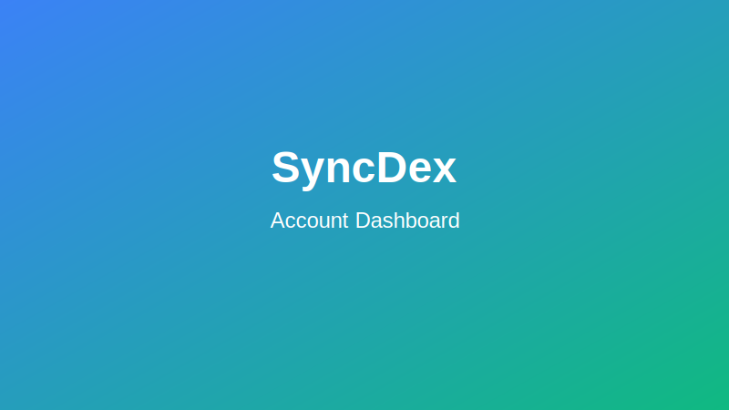

# Account Management on SyncDex

This guide provides an overview of your SyncDex account features, settings, and management options.

## Account Dashboard

After connecting your wallet to SyncDex, your account dashboard becomes your command center for all platform activities. Access it by clicking on your wallet address in the top right corner of the interface.

The dashboard displays:

- **Portfolio Summary**: Your total account value, available balance, and PnL
- **Asset Breakdown**: Distribution of assets in your portfolio
- **Open Positions**: Current active trades
- **Order History**: Record of your past transactions
- **Account Health**: Risk metrics and liquidation thresholds
- **Recent Activity**: Latest actions on your account

## Account Tiers

SyncDex offers multiple account tiers with increasing benefits and features:

| Tier | Requirements | Benefits |
|------|-------------|----------|
| Basic | No requirements | Standard trading features, up to 50x leverage |
| Silver | Hold 1,000 SYNC tokens or 30-day trading volume of $50,000+ | Reduced fees (0.07%), up to 75x leverage, priority support |
| Gold | Hold 10,000 SYNC tokens or 30-day trading volume of $250,000+ | Further reduced fees (0.05%), up to 100x leverage, VIP support, beta feature access |
| Diamond | Hold 50,000 SYNC tokens or 30-day trading volume of $1,000,000+ | Lowest fees (0.03%), maximum leverage, dedicated account manager, exclusive features |

Your current tier is displayed in your account dashboard. Tier benefits are automatically applied based on your SYNC token holdings or trading volume.

## Account Security

SyncDex offers multiple security features to protect your account:

### Two-Factor Authentication (2FA)

We highly recommend enabling 2FA for additional security:

1. Go to Account Settings > Security
2. Select "Enable 2FA"
3. Scan the QR code with your authenticator app
4. Enter the verification code
5. Save your backup codes securely

### Login Notifications

Receive email or push notifications whenever your account is accessed from a new device or location:

1. Go to Account Settings > Notifications
2. Enable "Security Alerts"
3. Verify your email address or mobile number

### IP Whitelisting

Restrict access to your account from specific IP addresses:

1. Go to Account Settings > Security
2. Select "IP Whitelist"
3. Add trusted IP addresses
4. Enable whitelist protection

## Wallet Management

### Connected Wallets

SyncDex allows you to connect multiple wallets to your account:

1. Go to Account Settings > Wallets
2. Click "Connect Additional Wallet"
3. Complete the wallet connection process
4. Set permissions for each wallet (trading, withdrawals, etc.)

### Address Book

Create an address book of trusted withdrawal destinations:

1. Go to Account Settings > Address Book
2. Click "Add New Address"
3. Enter the address details and label
4. Enable optional withdrawal limits

## Profile Settings

### Username and Avatar

Customize your identity on SyncDex:

1. Go to Account Settings > Profile
2. Update your username
3. Upload or select an avatar
4. Save changes

### Communication Preferences

Manage how you receive updates from SyncDex:

1. Go to Account Settings > Communications
2. Select your preferred channels (email, push, in-app)
3. Choose which types of notifications to receive
4. Set quiet hours if desired

## Transaction History

Access your complete transaction history:

1. Go to the "History" tab in your account dashboard
2. Filter by transaction type, date range, or asset
3. Export records for accounting or tax purposes
4. View detailed information for each transaction

## Account Analytics

SyncDex provides powerful analytics to help you understand your trading performance:

### Performance Metrics

1. Go to the "Analytics" section in your account dashboard
2. View key metrics like:
   - Win/loss ratio
   - Average position size
   - Profit factor
   - Maximum drawdown
   - ROI by time period

### Trading Patterns

Analyze your trading behavior with visualizations of:
- Entry/exit timing
- Position sizing trends
- Asset allocation over time
- Emotional trading indicators

## Account Limits

Your account has certain limits based on your tier and verification status:

| Action | Basic Limit | Silver Limit | Gold Limit | Diamond Limit |
|--------|------------|-------------|-----------|--------------|
| Max Withdrawal | $50,000/day | $100,000/day | $250,000/day | $500,000+/day |
| Position Size | Up to $250,000 | Up to $500,000 | Up to $1,000,000 | Unlimited |
| API Rate Limit | 10 requests/second | 25 requests/second | 50 requests/second | 100 requests/second |

To increase your limits, upgrade your account tier or complete additional verification.

## Account Support

Get help with your SyncDex account:

- **Help Center**: Browse articles and guides at [help.syncdex.finance](https://help.syncdex.finance)
- **Live Chat**: Available directly within the platform (bottom right corner)
- **Email Support**: Contact [support@syncdex.finance](mailto:support@syncdex.finance)
- **Discord Community**: Join our [Discord server](https://discord.gg/syncdex) for peer support

Premium account tiers receive priority support and faster response times.
