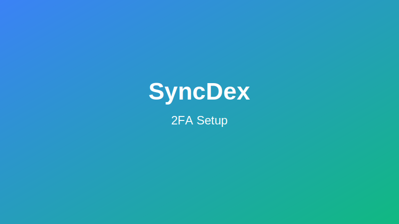
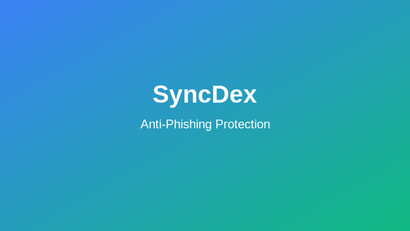

# Security Features on SyncDex

SyncDex takes security seriously and provides multiple layers of protection for your account and assets. This guide covers all security features and best practices for keeping your account safe.

## Wallet Security

### Secure Connection

SyncDex implements secure wallet connection protocols:

- **Signed Messages**: Authentication without exposing private keys
- **EIP-712**: Structured data signing for secure transactions
- **WalletConnect v2**: Enhanced security for mobile wallet connections

### Connection Monitoring

All wallet connections are monitored for suspicious activity:

- Real-time monitoring of connection requests
- Automatic detection of unusual device patterns
- Immediate notification of new wallet connections

## Account Protection

### Two-Factor Authentication (2FA)

Enable 2FA to add an extra layer of security beyond your wallet:

1. Go to Account Settings > Security
2. Click "Enable 2FA"
3. Choose your preferred method:
   - Authenticator app (recommended)
   - SMS verification
   - Email verification
4. Complete the setup process
5. Store backup codes in a secure location

### Session Management

Monitor and control active sessions:

1. Go to Account Settings > Security > Sessions
2. View all devices currently logged into your account
3. See location, device type, and last activity
4. Revoke access for any suspicious sessions

### Anti-Phishing Protection

Protect yourself from phishing attempts:

1. Create a unique anti-phishing code in your security settings
2. This code will appear in all legitimate SyncDex emails
3. If an email lacks your code, it's likely fraudulent

### IP Whitelisting

Restrict account access to trusted IP addresses:

1. Go to Account Settings > Security > IP Whitelist
2. Add trusted IP addresses
3. Enable "Enforce IP Whitelist"
4. Choose security level:
   - Notifications only
   - Require additional verification
   - Block non-whitelisted access

## Transaction Security

### Withdrawal Safeguards

Multiple layers of protection for withdrawals:

1. **Withdrawal Addresses**: Whitelist trusted addresses
2. **Withdrawal Delays**: Optional time-lock for large withdrawals
3. **Approval Requirements**: Multi-signature options for team accounts
4. **Limit Controls**: Set daily/weekly withdrawal limits

### Advanced Transaction Verification

For high-value transactions, SyncDex may require:

- Additional 2FA verification
- Email confirmation
- Cooling-off period
- Manual review (for very large transactions)

## Smart Contract Security

SyncDex's smart contracts undergo rigorous security measures:

- Multiple independent security audits
- Open-source code for public review
- Bug bounty program
- Formal verification of critical functions
- Time-locked admin functions
- Upgradable proxy architecture with timelock

### Security Audit Reports

View our latest security audits:

- [Certik Audit Report](https://certik.com/syncdex)
- [ChainSecurity Audit Report](https://chainsecurity.com/syncdex-audit)
- [OpenZeppelin Audit Report](https://openzeppelin.com/security-audits/syncdex)

## Privacy Features

### Data Protection

SyncDex implements strong data protection measures:

- End-to-end encryption for sensitive data
- Minimal data collection policy
- Compliance with global privacy standards
- Regular privacy audits
- User data deletion options

### Privacy Settings

Customize your privacy preferences:

1. Go to Account Settings > Privacy
2. Configure what information is shared with:
   - Other users
   - API integrations
   - Analytics systems

## Security Best Practices

### Recommended User Actions

Follow these best practices to maximize your security on SyncDex:

1. **Use a hardware wallet** when possible
2. **Enable all security features** in your account settings
3. **Create a strong password** for your email account linked to SyncDex
4. **Never share your private keys** or seed phrase with anyone
5. **Verify the website URL** before connecting your wallet
6. **Keep software updated** (wallet apps, browsers, operating systems)
7. **Use a separate device** for high-value transactions
8. **Enable notifications** for all account activity
9. **Review connected applications** regularly and revoke unused connections
10. **Create a dedicated trading wallet** separate from your main holdings

### Warning Signs

Be alert for these potential security threats:

- Requests to share your seed phrase or private keys
- Unsolicited messages about exclusive opportunities
- Pressure to act quickly due to "limited time offers"
- Website URLs with slight misspellings or different TLDs
- Absence of your anti-phishing code in emails
- Unexpected wallet connection requests

## Security Response

### Report Security Concerns

If you notice suspicious activity:

1. Go to Security Center > Report Concern
2. Select the type of issue
3. Provide details of the suspicious activity
4. Include screenshots if available
5. Submit the report

The SyncDex security team will investigate and respond within 24 hours.

### Account Lockdown

In case of a security emergency:

1. Go to Account Settings > Security
2. Select "Emergency Lockdown"
3. This immediately:
   - Blocks all withdrawals
   - Requires verification for all actions
   - Notifies the SyncDex security team
   - Prevents new device logins

### Security Status

Check the current security status of the SyncDex platform:

1. Visit [status.syncdex.finance](https://status.syncdex.finance)
2. View real-time updates on security incidents
3. Subscribe to alerts for immediate notification of issues

## Bug Bounty Program

SyncDex maintains an active bug bounty program:

- Rewards up to $250,000 for critical vulnerabilities
- Responsible disclosure policy
- Public acknowledgment for security researchers
- Visit [security.syncdex.finance/bounty](https://security.syncdex.finance/bounty) to learn more
