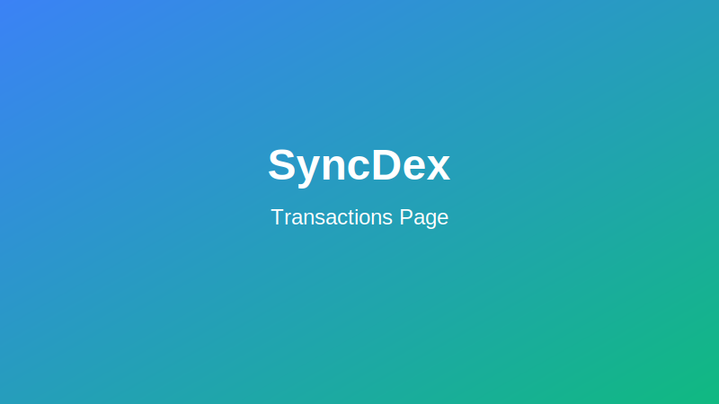
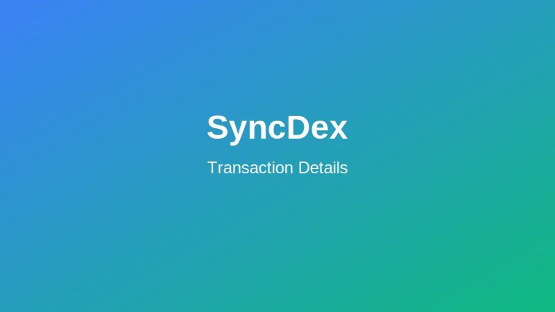

# Transaction History and Management

SyncDex provides comprehensive tools for tracking, analyzing, and managing your transaction history. This guide explains how to access and use these features.

## Accessing Your Transaction History

To view your transaction history:

1. Log in to your SyncDex account
2. Navigate to "Account" > "Transactions" in the main navigation
3. Alternatively, click on the "Transactions" tab in your account dashboard

## Understanding the Transaction Interface

The transactions interface displays the following information for each transaction:

- **Date & Time**: When the transaction was executed
- **Type**: The category of transaction (trade, deposit, withdrawal, etc.)
- **Market**: Trading pair involved (for trades)
- **Side**: Buy or sell (for trades)
- **Amount**: Quantity of assets involved
- **Price**: Execution price (for trades)
- **Total Value**: Total value in USD or your preferred currency
- **Fee**: Any fees associated with the transaction
- **Status**: Current status of the transaction
- **Transaction Hash**: Blockchain transaction ID

## Transaction Types

SyncDex tracks various transaction types:

### Trading Transactions
- **Market Orders**: Immediate trades at market price
- **Limit Orders**: Orders executed at specific price targets
- **Stop Orders**: Triggered orders based on price conditions
- **Liquidations**: Forced position closures due to insufficient margin

### Wallet Transactions
- **Deposits**: Funds added to your SyncDex account
- **Withdrawals**: Funds removed from your SyncDex account
- **Internal Transfers**: Movements between SyncDex account wallets

### Account Transactions
- **Fee Payments**: Trading fees, funding fees, etc.
- **Rewards**: Staking rewards, referral bonuses, etc.
- **Adjustments**: Manual adjustments by support team

## Filtering and Searching Transactions

### Basic Filters

Use these filters to narrow down your transaction history:

1. **Date Range**: Select specific time periods
2. **Transaction Type**: Filter by specific transaction categories
3. **Market/Pair**: View transactions for specific trading pairs
4. **Status**: Filter by transaction status (completed, pending, failed)

### Advanced Search Options

For more precise searches:

1. Click "Advanced Search"
2. Use options like:
   - Amount range
   - Price range
   - Specific blockchain networks
   - Transaction hashes
   - Order IDs

## Transaction Details

To view detailed information about any transaction:

1. Click on the transaction in your history list
2. The expanded view shows:
   - Complete transaction details
   - Fee breakdown
   - Related transactions
   - Blockchain confirmation status
   - Network details

### Blockchain Explorer Integration

For on-chain transactions:

1. Click the "View on Explorer" button
2. You'll be directed to the appropriate blockchain explorer
3. Verify transaction details, confirmations, and network status

## Transaction Exports

Export your transaction history for accounting, tax, or record-keeping purposes:

### Export Options

1. Go to the Transactions page
2. Click "Export"
3. Choose your preferred format:
   - CSV
   - Excel
   - PDF
   - API-compatible JSON

### Scheduled Reports

Set up automatic transaction reports:

1. Go to Account Settings > Reports
2. Click "Add Scheduled Report"
3. Select report type, frequency, and delivery method
4. Choose between email delivery or cloud storage options

## Tax Reporting

SyncDex offers built-in tax reporting features:

### Tax Report Generation

1. Go to "Transactions" > "Tax Reports"
2. Select the tax year
3. Choose your country/jurisdiction
4. Click "Generate Tax Report"

### Third-Party Tax Tool Integration

SyncDex integrates with popular crypto tax software:

1. Go to "Transactions" > "Tax Integrations"
2. Select your preferred tax software:
   - CoinTracker
   - Koinly
   - TaxBit
   - CryptoTaxCalculator
3. Follow the integration instructions

## Transaction Notifications

Customize how you're notified about transactions:

1. Go to Account Settings > Notifications > Transactions
2. Enable/disable notifications for:
   - Completed trades
   - Filled orders
   - Deposits and withdrawals
   - Failed transactions
   - Large value movements
3. Choose notification methods:
   - Push notifications
   - Email alerts
   - SMS notifications

## Transaction Security Features

### Suspicious Activity Detection

SyncDex automatically flags potentially suspicious transactions:

- Unusual trading patterns
- Transactions from new locations
- Withdrawals to new addresses
- Transactions during inactive hours

### Transaction Verification

For high-value or suspicious transactions:

1. Additional verification may be required
2. Follow the verification prompts
3. Use your 2FA device or email verification

## Troubleshooting Transaction Issues

### Pending Transactions

If a transaction remains pending for an extended period:

1. Check the network status on the blockchain explorer
2. Verify that gas fees were sufficient (for on-chain transactions)
3. Contact support if the issue persists beyond 30 minutes

### Failed Transactions

For transactions that have failed:

1. Click on the failed transaction to view the failure reason
2. Common reasons include:
   - Insufficient funds
   - Network congestion
   - Slippage tolerance exceeded
   - Smart contract errors
3. Follow the recommended resolution steps

### Transaction Support

For transaction-related issues:

1. Click "Get Help" on any transaction
2. Select the issue type
3. Provide additional details if requested
4. A support representative will assist you

## Transaction Analytics

Gain insights from your transaction history:

1. Go to "Transactions" > "Analytics"
2. View visualized data on:
   - Trading volume over time
   - Fee expenditure
   - Profit/loss by market
   - Trading patterns and behavior
   - Portfolio allocation changes

Use these insights to refine your trading strategy and optimize your performance on SyncDex.
