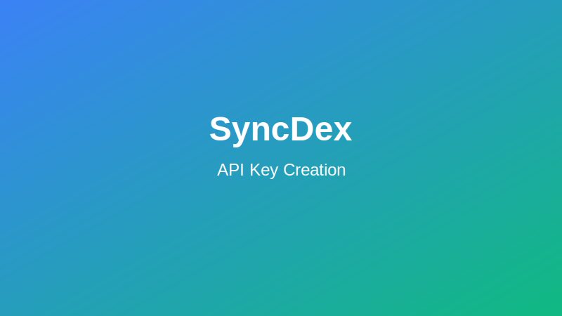

# API Authentication

This guide explains how to authenticate with the SyncDex API and secure your API connections.

## Creating API Keys

### Prerequisites

Before creating an API key, you need:
- An active SyncDex account
- Two-factor authentication (2FA) enabled on your account
- Completion of at least Basic verification level

### API Key Creation Process

1. Log in to your SyncDex account
2. Navigate to Account > API Management
3. Click "Create New API Key"
4. Complete the following steps:
   - Select key type (Read-Only, Trading, or Master)
   - Set a descriptive label (e.g., "Trading Bot Alpha")
   - Configure permissions (for Trading and Master keys)
   - Set IP restrictions (recommended)
   - Enable additional security features as needed
5. Confirm with your 2FA code
6. Save your API Key and Secret



:::warning
Your Secret Key will only be displayed once. Store it securely immediately after creation. If you lose your Secret Key, you'll need to generate a new API Key pair.
:::

## API Key Types and Permissions

### Read-Only Keys

Read-only keys can:
- Access market data
- View account balances
- Check order history
- Read account information

They cannot:
- Place or cancel orders
- Withdraw funds
- Modify account settings

### Trading Keys

Trading keys include all read-only permissions plus:
- Place new orders
- Cancel existing orders
- Modify open orders

They cannot:
- Withdraw funds
- Change account settings
- Access sub-accounts

### Master Keys

Master keys have full account access including:
- All trading key permissions
- Withdrawal capabilities (if enabled)
- Account settings modification
- Sub-account management

:::caution
Master keys have extensive permissions and should be used with extreme caution. Enable additional security features like IP restrictions and withdrawal confirmations.
:::

## Authentication Methods

### REST API Authentication

All authenticated REST requests must include the following HTTP headers:

```
X-SD-APIKEY: YOUR_API_KEY
X-SD-TIMESTAMP: REQUEST_TIMESTAMP
X-SD-SIGNATURE: YOUR_SIGNATURE
```

Where:
- `YOUR_API_KEY` is your SyncDex API Key
- `REQUEST_TIMESTAMP` is the current Unix timestamp in milliseconds
- `YOUR_SIGNATURE` is an HMAC-SHA256 signature of your request

### Creating a Valid Signature

To create a valid signature, follow these steps:

1. Create a string by concatenating: `timestamp + method + endpoint + (body if POST/PUT)`
   - `timestamp`: Unix timestamp in milliseconds
   - `method`: HTTP method in uppercase (GET, POST, PUT, DELETE)
   - `endpoint`: The path component of the URL, including query string
   - `body`: The JSON request body for POST/PUT requests (empty string for GET/DELETE)

2. Generate an HMAC-SHA256 signature using your API Secret as the key

3. Convert the signature to hexadecimal format

#### Example in JavaScript

```javascript
const crypto = require('crypto');

function generateSignature(apiSecret, timestamp, method, endpoint, body = '') {
  const message = timestamp + method + endpoint + body;
  return crypto
    .createHmac('sha256', apiSecret)
    .update(message)
    .digest('hex');
}

// Example usage
const apiKey = 'YOUR_API_KEY';
const apiSecret = 'YOUR_API_SECRET';
const timestamp = Date.now().toString();
const method = 'GET';
const endpoint = '/api/v1/account/balance';
const signature = generateSignature(apiSecret, timestamp, method, endpoint);

// Add to request headers
const headers = {
  'X-SD-APIKEY': apiKey,
  'X-SD-TIMESTAMP': timestamp,
  'X-SD-SIGNATURE': signature
};
```

#### Example in Python

```python
import time
import hmac
import hashlib
import requests

def generate_signature(api_secret, timestamp, method, endpoint, body=''):
    message = timestamp + method + endpoint + body
    signature = hmac.new(
        api_secret.encode('utf-8'),
        message.encode('utf-8'),
        hashlib.sha256
    ).hexdigest()
    return signature

# Example usage
api_key = 'YOUR_API_KEY'
api_secret = 'YOUR_API_SECRET'
timestamp = str(int(time.time() * 1000))
method = 'GET'
endpoint = '/api/v1/account/balance'
signature = generate_signature(api_secret, timestamp, method, endpoint)

# Add to request headers
headers = {
    'X-SD-APIKEY': api_key,
    'X-SD-TIMESTAMP': timestamp,
    'X-SD-SIGNATURE': signature
}

response = requests.get(
    'https://api.syncdex.finance' + endpoint,
    headers=headers
)
```

### WebSocket Authentication

WebSocket connections require an authentication message within 5 seconds of establishing a connection:

1. Connect to the WebSocket endpoint
2. Send the authentication message:

```json
{
  "op": "auth",
  "args": [
    "YOUR_API_KEY",
    "REQUEST_TIMESTAMP",
    "SIGNATURE"
  ]
}
```

Where the signature is generated using the same method as REST API authentication, with the message format:

```
timestamp + "auth"
```

#### Example WebSocket Authentication in JavaScript

```javascript
const WebSocket = require('ws');
const crypto = require('crypto');

function generateSignature(apiSecret, timestamp, operation) {
  const message = timestamp + operation;
  return crypto
    .createHmac('sha256', apiSecret)
    .update(message)
    .digest('hex');
}

const apiKey = 'YOUR_API_KEY';
const apiSecret = 'YOUR_API_SECRET';
const timestamp = Date.now().toString();
const operation = 'auth';
const signature = generateSignature(apiSecret, timestamp, operation);

const ws = new WebSocket('wss://ws.syncdex.finance/v1');

ws.on('open', function open() {
  const authMessage = {
    op: 'auth',
    args: [apiKey, timestamp, signature]
  };
  
  ws.send(JSON.stringify(authMessage));
});

ws.on('message', function incoming(data) {
  console.log(data);
});
```

## Security Best Practices

### IP Restrictions

Limit API access to specific IP addresses:

1. When creating or editing an API key, add trusted IP addresses
2. You can specify individual IPs or CIDR ranges (e.g., 192.168.1.0/24)
3. Up to 10 entries can be added per API key

### Key Management

- Store API secrets securely, preferably in environment variables or a secure vault
- Never hardcode API secrets in your application code
- Do not include API secrets in client-side code
- Regularly rotate your API keys (recommended every 90 days)
- Use separate API keys for different applications or purposes
- Set the minimum required permissions for each key

### Request Validation

- Verify SSL/TLS certificates when connecting to the API
- Validate response data formats before processing
- Implement request timeouts to handle connection issues
- Check for replay attacks by validating timestamp freshness (within 60 seconds)

### Monitoring

- Monitor API usage patterns for unusual activity
- Set up alerts for:
  - Failed authentication attempts
  - Sudden increases in request volume
  - Requests from new geographic locations
  - Withdrawal attempts
  - Changes to API key permissions

## Troubleshooting Authentication Issues

### Common Error Codes

| Error Code | Description | Solution |
|------------|-------------|----------|
| 1001 | Invalid API key | Verify your API key is correct and active |
| 1002 | Invalid signature | Check your signature generation code and ensure clocks are synchronized |
| 1003 | Invalid timestamp | Ensure your system time is accurate (within 60 seconds of server time) |
| 1004 | IP not allowed | Add your current IP address to the allowed list |
| 1005 | Permission denied | Verify your API key has the necessary permissions |
| 1006 | Expired API key | Generate a new API key pair |

### Clock Synchronization

Authentication relies on accurate timestamps:
1. Ensure your system clock is synchronized with an NTP server
2. If you receive timestamp errors, check the time difference with the API server:
   ```
   GET /api/v1/time
   ```
   This returns the current server time, which you can compare with your local time.

### Testing Authentication

Use the following endpoint to test your authentication:

```
GET /api/v1/account/auth-test
```

A successful response confirms your authentication is working correctly.
