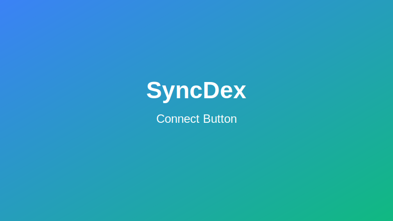
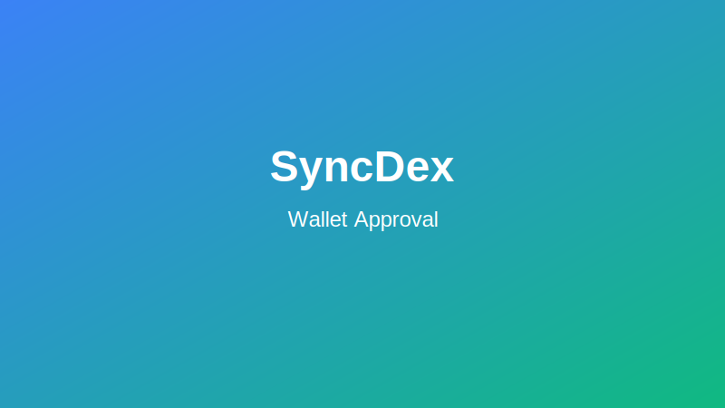

# Connecting Your Wallet to SyncDex

This guide explains how to connect your Web3 wallet to the SyncDex platform to start trading.

## Supported Wallets

SyncDex supports a wide variety of Web3 wallets, including:

- **MetaMask**: The most popular Ethereum wallet browser extension
- **WalletConnect**: For connecting mobile wallets to web dApps
- **Coinbase Wallet**: User-friendly wallet by Coinbase
- **Trust Wallet**: Multi-chain mobile wallet
- **Ledger**: Hardware wallet for enhanced security
- **Trezor**: Hardware wallet with advanced security features

## Connection Steps

### 1. Access SyncDex Platform

Navigate to the [SyncDex trading platform](https://app.syncdex.finance) using a desktop or mobile browser.

### 2. Click "Connect Wallet"

Locate and click the "Connect Wallet" button in the top right corner of the navigation bar.

### 3. Select Your Wallet

Choose your preferred wallet from the connection modal that appears:

:::info
If you don't see your wallet listed, you can use WalletConnect as a universal connection option that works with most mobile wallets.
:::

### 4. Approve the Connection Request

Your wallet will prompt you to approve the connection to SyncDex:

1. Verify that the site URL is correct (`app.syncdex.finance`)
2. Review the requested permissions
3. Click "Connect" or "Approve" in your wallet

### 5. Select Network (if required)

If your wallet is connected to a network that SyncDex doesn't support, you'll be prompted to switch networks. SyncDex currently supports:

- Ethereum Mainnet
- Arbitrum
- Optimism
- Polygon
- BNB Chain
- Avalanche
- Base

Click "Switch Network" when prompted to automatically change to the correct network.

## Troubleshooting Connection Issues

### Wallet Not Connecting

If your wallet isn't connecting:
1. Refresh the page and try again
2. Make sure your wallet is unlocked
3. Check if you have any pending wallet notifications
4. Verify that you're using a supported browser and wallet version

### Network Issues

If you're experiencing network-related problems:
1. Ensure you're on a supported network
2. Check if the network is congested or experiencing issues
3. Verify your wallet has sufficient funds for gas fees

### Browser Permissions

Some browsers may block wallet connections:
1. Check for blocked popups
2. Ensure site permissions allow for wallet connections
3. Disable any browser extensions that might interfere with Web3 connections

## Security Best Practices

When connecting your wallet to SyncDex or any dApp:

1. **Always verify the URL** - Make sure you're on `app.syncdex.finance` and not a phishing site
2. **Review permissions** - Only approve connections that request necessary permissions
3. **Use hardware wallets** for large transactions - Hardware wallets provide additional security
4. **Create a dedicated trading wallet** - Consider using a separate wallet with limited funds for trading
5. **Regularly check connected sites** - Periodically review and revoke access to sites you no longer use

:::warning
Never share your wallet's recovery phrase or private keys with anyone, including SyncDex support. Legitimate support will never ask for this information.
:::

## Next Steps

Once your wallet is successfully connected to SyncDex:
1. [Make your first trade](./first-trade.md)
2. Explore the [trading interface](../trading/guide.md)
3. Learn about [account management](../account/overview.md)
