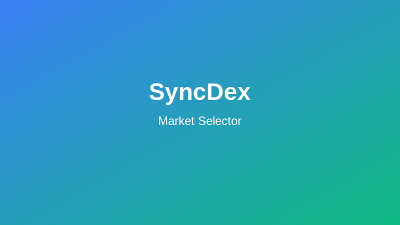
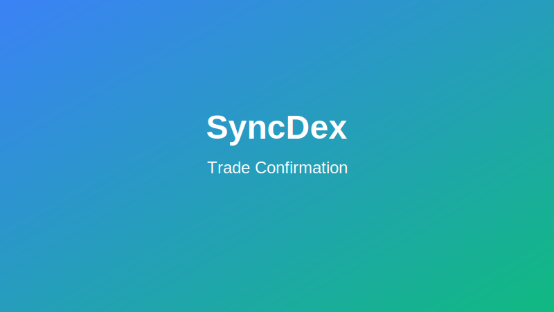

# Making Your First Trade on SyncDex

This guide will walk you through the process of executing your first trade on the SyncDex platform. We'll cover the basic steps to get you started with trading cryptocurrencies quickly and confidently.

## Prerequisites

Before making your first trade, ensure you have:
- [Connected your wallet](./connect-wallet.md) to SyncDex
- Funded your wallet with the cryptocurrency you want to trade and some native tokens for gas fees

## Step 1: Navigate to the Trading Interface

After connecting your wallet, you'll be directed to the SyncDex trading interface. If you're on another page, click the "Trade" button in the main navigation.

## Step 2: Select a Trading Pair

1. In the top left corner of the trading interface, you'll see the current trading pair (e.g., ETH/USDC).
2. Click on this area to open the market selector.
3. Use the search function or browse through the available markets to find your desired trading pair.
4. Click on a pair to select it.

## Step 3: Choose Your Order Type

SyncDex offers several order types to suit different trading strategies:

- **Market Order**: Executes immediately at the best available price
- **Limit Order**: Sets a specific price at which you want to buy or sell
- **Stop Order**: Triggers a market or limit order when the price reaches a certain level

For your first trade, we recommend using a **Market Order** for its simplicity.

## Step 4: Enter Your Trade Details

1. Select "Buy" or "Sell" depending on whether you want to purchase or sell the base asset.
2. Enter the amount you wish to trade.
   - You can specify the amount in the base currency (e.g., ETH) or the quote currency (e.g., USDC).
   - Use the percentage buttons (25%, 50%, 75%, 100%) to quickly select a portion of your available balance.

## Step 5: Review Trade Details

Before confirming your trade, carefully review:
- The trading pair
- Order type
- Amount to trade
- Estimated execution price
- Any applicable fees
- Slippage tolerance (for market orders)

## Step 6: Execute the Trade

1. Click the "Buy" or "Sell" button (depending on your selected action).
2. A confirmation modal will appear showing the final trade details.
3. Click "Confirm" to proceed.
4. Your wallet will prompt you to approve the transaction.
5. Review the gas fees and confirm in your wallet.

## Step 7: Monitor Your Trade

Once confirmed, your trade will execute:
- Market orders typically complete within seconds
- Limit and stop orders will remain active until they're filled, canceled, or expired
- You can monitor active orders in the "Open Orders" tab

## Understanding Trade Status

After execution, your trade will show one of these statuses:

- **Filled**: The order has been completely executed
- **Partially Filled**: Only part of your order has been executed
- **Open**: The order is active but not yet executed (limit/stop orders)
- **Failed**: The transaction failed (check your wallet for details)

## Managing Your Position

After your trade is filled, you can view and manage your position:

1. Check the "Positions" tab to see your active positions
2. Monitor your position's profit/loss (P&L)
3. Set take-profit or stop-loss orders to manage risk
4. Close your position when ready by clicking "Close Position"

## Next Steps

Now that you've completed your first trade, consider exploring these advanced features:

- [Different order types](../trading/order-types.md)
- [Trading with leverage](../trading/leverage.md)
- [Cross-chain trading](../trading/cross-chain.md)
- [Account management tools](../account/overview.md)

Remember to always practice risk management and never trade more than you can afford to lose.
