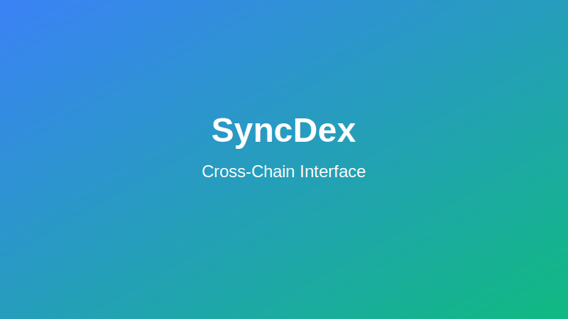

# Cross-Chain Trading on SyncDex

SyncDex's innovative cross-chain functionality allows you to trade assets across different blockchain networks without manually bridging tokens. This guide explains how to use this feature, its benefits, and technical considerations.

## What is Cross-Chain Trading?

Cross-chain trading enables you to:
- Trade assets that exist on different blockchains
- Swap tokens across networks in a single transaction
- Access liquidity from multiple chains simultaneously

## Supported Networks

SyncDex currently supports cross-chain trading between the following networks:

- Ethereum Mainnet
- Arbitrum
- Optimism
- Polygon
- BNB Chain
- Avalanche
- Base

## How It Works

SyncDex uses a combination of liquidity aggregation and message passing protocols to enable seamless cross-chain transactions:

1. **Source Chain**: The blockchain where your input asset exists
2. **Destination Chain**: The blockchain where you'll receive your output asset
3. **Bridge Protocol**: The underlying infrastructure that securely moves value between chains

### Technical Process

When you execute a cross-chain trade on SyncDex:

1. Your transaction on the source chain is submitted
2. SyncDex's smart contracts lock your input assets
3. A cryptographic proof is generated and sent to the destination chain
4. The proof is verified on the destination chain
5. The equivalent output assets are released to your wallet

This process typically takes 3-5 minutes depending on the networks involved and their respective confirmation times.

## Using Cross-Chain Trading

### Step 1: Select Cross-Chain Mode

In the trading interface, toggle the "Cross-Chain" option to activate cross-chain trading mode.

### Step 2: Select Networks and Assets

1. Choose your source network (where you currently hold assets)
2. Select the destination network (where you want to receive assets)
3. Choose the trading pair (input and output assets)

### Step 3: Enter Trade Details

1. Enter the amount you wish to trade
2. Review the estimated output amount
3. Note the estimated processing time
4. Check the fee breakdown (including bridge fees)

### Step 4: Confirm and Execute

1. Click "Review Transaction" to see the complete details
2. Confirm the cross-chain swap
3. Approve the transaction in your wallet
4. Wait for the cross-chain verification process to complete

## Cross-Chain Fees

Cross-chain transactions involve several types of fees:

1. **Source Chain Gas Fee**: To execute the initial transaction
2. **Bridge Fee**: Paid to the cross-chain bridge protocol (varies by network and transaction size)
3. **Destination Chain Gas Fee**: Covered by SyncDex
4. **SyncDex Service Fee**: A small fee for facilitating the cross-chain swap (typically 0.3%)

The total fees will be displayed before you confirm your transaction.

## Monitoring Cross-Chain Transactions

After initiating a cross-chain swap, you can track its progress:

1. Go to the "Transactions" tab in your SyncDex account
2. Find your cross-chain transaction
3. View the detailed status showing each step of the process:
   - Source Chain Confirmation
   - Bridge Processing
   - Destination Chain Confirmation
   - Completion

Each cross-chain transaction has a unique identifier that can be used to track it across networks.

## Security Considerations

SyncDex implements several security measures for cross-chain trading:

- **Time Locks**: Protection against certain types of attacks
- **Merkle Proofs**: Cryptographic verification of cross-chain transactions
- **Multi-Signature Verification**: For high-value transactions
- **Slippage Protection**: To guard against price movement during processing
- **Failsafe Mechanisms**: Ability to recover funds if a cross-chain transaction fails

## Advanced Features

### Cross-Chain Limit Orders

Place limit orders that execute across chains when specific price conditions are met.

### Cross-Chain Liquidity Provision

Provide liquidity to cross-chain pools and earn fees from facilitating cross-chain swaps.

### Cross-Chain Dollar Cost Averaging (DCA)

Set up automated recurring purchases of assets on different chains from a single source.

## Troubleshooting

### Delayed Transactions

If your cross-chain transaction is taking longer than expected:

1. Check the network status of both source and destination chains
2. Verify that your transaction has sufficient confirmations on the source chain
3. Contact SyncDex support if a transaction remains pending for more than 30 minutes

### Failed Transactions

In rare cases, cross-chain transactions may fail due to:
- Network congestion or outages
- Insufficient gas on the source chain
- Price movement exceeding slippage tolerance

If a transaction fails, funds will be automatically returned to your wallet on the source chain (typically within 15-30 minutes).

### Recovering Stuck Transactions

If you believe your transaction is stuck:
1. Go to the "Transactions" tab in your account
2. Locate the transaction and click "Details"
3. Select "Request Recovery" if the option is available
4. Follow the instructions to initiate the recovery process

## Best Practices

1. **Start small** when first using cross-chain features
2. **Consider timing** - network congestion can affect processing speed
3. **Compare fees** - sometimes direct bridging might be more economical for large amounts
4. **Check network status** before initiating large cross-chain transactions
5. **Keep records** of all transaction IDs and confirmations
