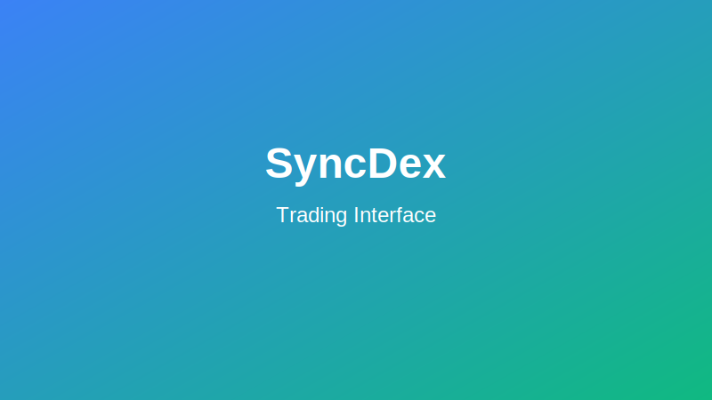

# SyncDex Trading Guide

This comprehensive guide explains how to execute trades on SyncDex's advanced trading platform.

## The Trading Interface

The SyncDex trading interface is designed for efficiency and clarity, featuring:



1. **Market Selector**: Choose the trading pair you want to interact with
2. **Price Chart**: Real-time price data with customizable technical indicators
3. **Order Book**: Live view of buy and sell orders
4. **Trading Form**: Place different types of orders
5. **Position Manager**: Monitor and manage your open positions
6. **Recent Trades**: View latest transactions on the selected market

## Order Types

### Market Orders

Market orders execute immediately at the best available price.

```
Steps:
1. Select the trading pair
2. Choose "Market" order
3. Enter the amount to buy/sell
4. Click "Buy" or "Sell"
```

:::tip
Market orders provide fast execution but may experience slippage during volatile market conditions.
:::

### Limit Orders

Limit orders allow you to set a specific price at which you want to buy or sell.

```
Steps:
1. Select the trading pair
2. Choose "Limit" order
3. Enter the price you want to buy/sell at
4. Enter the amount to buy/sell
5. Click "Buy" or "Sell"
```

### Stop Orders

Stop orders help manage risk by automatically executing when prices reach specified levels.

#### Stop Loss

```
Steps:
1. Open a position first
2. In position management, click "Add Stop Loss"
3. Enter your stop price
4. Confirm the order
```

#### Take Profit

```
Steps:
1. Open a position first
2. In position management, click "Add Take Profit"
3. Enter your target price
4. Confirm the order
```

## Leverage Trading

SyncDex offers leverage trading, allowing you to borrow funds to increase your position size.

```
Steps:
1. Select the trading pair
2. Adjust the leverage slider (1x to 100x)
3. Enter the position size
4. Review liquidation price carefully
5. Confirm the trade
```

:::warning
Leverage trading significantly increases risk. Even small market movements can lead to liquidation of your position. Only use leverage if you fully understand the risks involved.
:::

## Cross-Chain Trading

SyncDex's unique cross-chain functionality lets you trade assets across different blockchains without manual bridging.

```
Steps:
1. Select a trading pair that spans two networks
2. Choose your order type
3. Enter trading amount
4. Confirm the cross-chain transaction
5. Wait for cross-chain verification (may take 3-5 minutes)
```

## Advanced Trading Features

### Portfolio Hedging

Hedge your portfolio by taking opposing positions in correlated markets.

### Dollar-Cost Averaging (DCA)

Set up automated recurring purchases to average your entry price over time.

```
Steps:
1. Go to "DCA" section
2. Select the trading pair
3. Set purchase amount and frequency
4. Configure start/end dates or total investment
5. Confirm setup
```

### Grid Trading

Automatically buy low and sell high within a specified price range.

```
Steps:
1. Go to "Grid Trading" section
2. Select the trading pair
3. Set upper and lower price boundaries
4. Choose number of grid levels
5. Set total investment amount
6. Start grid bot
```

## Risk Management Tips

- Start with small position sizes until familiar with the platform
- Always use stop losses, especially with leveraged positions
- Monitor your positions regularly
- Consider setting price alerts for significant market moves
- Diversify your trading portfolio across different assets and strategies

:::tip
The most successful traders focus on consistent risk management rather than seeking massive gains on individual trades.
:::
