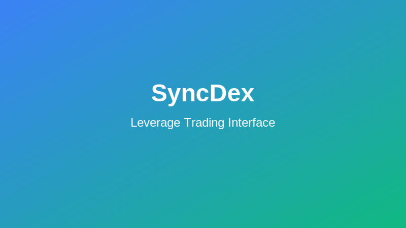

# Leverage Trading on SyncDex

Leverage trading allows you to open positions larger than your account balance by borrowing funds. This guide explains how leverage works on SyncDex, its benefits, risks, and best practices.

## Understanding Leverage

Leverage is expressed as a multiplier (e.g., 5x, 10x, 100x) that increases your exposure to a market. For example:

- With $100 and 5x leverage, you can open a position worth $500
- With $100 and 10x leverage, you can open a position worth $1,000
- With $100 and 100x leverage, you can open a position worth $10,000

## How Leverage Works on SyncDex

SyncDex offers leverage ranging from 1x to 100x, depending on the trading pair and your account tier.

### Margin Calculation

Your position's margin requirement is calculated as:

```
Required Margin = Position Size ÷ Leverage
```

Example: To open a $1,000 position with 10x leverage, you need $100 in margin ($1,000 ÷ 10).

### Available Leverage by Market

Different markets on SyncDex offer different maximum leverage levels:

| Market Type | Maximum Leverage |
|------------|-----------------|
| Major pairs (BTC, ETH) | Up to 100x |
| Mid-cap assets | Up to 50x |
| Small-cap assets | Up to 20x |
| Exotic pairs | Up to 10x |

Higher account tiers may have access to increased leverage limits.

## Liquidation Mechanics

### Understanding Liquidation Price

Liquidation occurs when your position's losses approach your margin amount. The liquidation price is calculated as:

```
For Long Positions:
Liquidation Price = Entry Price × (1 - (1 ÷ Leverage) + (Maintenance Margin + Fees))

For Short Positions:
Liquidation Price = Entry Price × (1 + (1 ÷ Leverage) - (Maintenance Margin + Fees))
```

Where:
- Maintenance Margin: The minimum equity required to keep your position open (varies by asset)
- Fees: Trading and funding fees

### Liquidation Process

If the market price approaches your liquidation price:

1. You'll receive a margin call notification when equity falls below 110% of maintenance margin
2. You can add more margin to avoid liquidation
3. If no action is taken and the price reaches the liquidation level, your position is automatically closed

SyncDex uses a staged liquidation process to minimize market impact for large positions.

## Funding Rates

Leverage positions on SyncDex are subject to funding rates, which are periodic payments exchanged between longs and shorts.

- Positive funding rate: Long positions pay shorts
- Negative funding rate: Short positions pay longs

Funding occurs every 8 hours and is calculated based on the difference between perpetual contract prices and the underlying index.

## Risk Management

### Setting Stop Losses

Always use stop-loss orders when trading with leverage. A recommended practice is to set stop losses at:

```
Stop Loss = Entry Price ± (Entry Price × (0.5 ÷ Leverage))
```

For example, with 10x leverage, consider a stop loss at approximately 5% away from your entry.

### Position Sizing

A common risk management guideline is to risk no more than 1-2% of your total capital on any single leveraged trade.

Example calculation for proper position sizing:
```
Max Position Size = (Account Balance × Risk Percentage) ÷ ((Entry Price - Stop Loss) ÷ Entry Price)
```

### Leverage Best Practices

1. **Start small**: Begin with lower leverage (2x-3x) until comfortable with the mechanics
2. **Monitor actively**: Leveraged positions require more frequent monitoring
3. **Use protective orders**: Implement stop-loss and take-profit orders
4. **Understand fees**: Factor in trading fees and funding rates, which compound with leverage
5. **Watch for volatility**: Higher leverage amplifies the effect of market volatility

## Advanced Leverage Strategies

### Scaling In/Out

Rather than entering a full position at once, consider:
- Scaling in: Gradually increasing position size as market confirms direction
- Scaling out: Taking partial profits at different price targets

### Hedging

Use leverage to create hedge positions that protect your portfolio against adverse price movements.

Example: If you hold 1 BTC, you might open a 1x short position on BTC to neutralize price exposure temporarily.

### Arbitrage

Leverage can enhance returns from arbitrage opportunities between:
- Different exchanges
- Spot and futures markets
- Funding rate differentials

## Tutorial: Opening a Leveraged Position

1. Select your trading pair from the market selector
2. On the trading form, locate the leverage slider
3. Adjust the leverage to your desired level (e.g., 5x)
4. Note how your buying power increases and the liquidation price changes
5. Enter your position size
6. Set stop-loss and take-profit levels
7. Review all details, especially the liquidation price
8. Click "Long" or "Short" to open your position



## Warning

:::caution
Leverage trading significantly increases both potential rewards AND risks. You can lose more than your initial margin amount due to fees and market gaps. Only trade with leverage after thoroughly understanding the mechanics and risks involved.
:::

Remember: The most successful traders focus on consistent risk management rather than seeking massive gains on individual trades.
